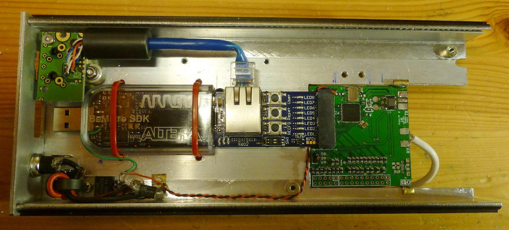
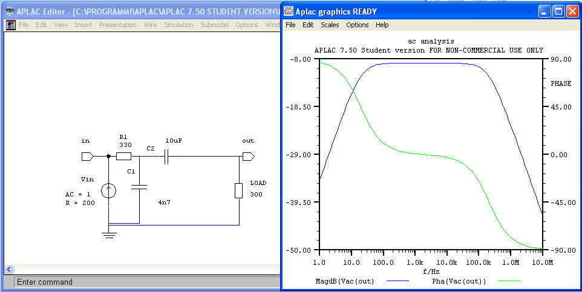
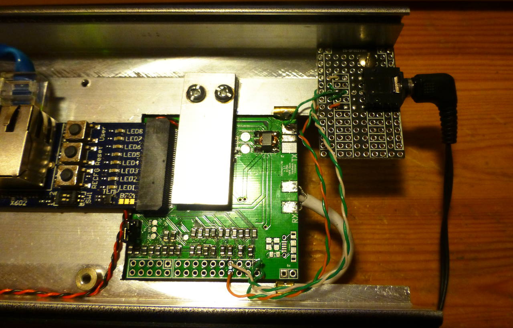
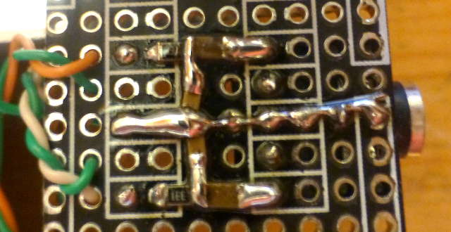
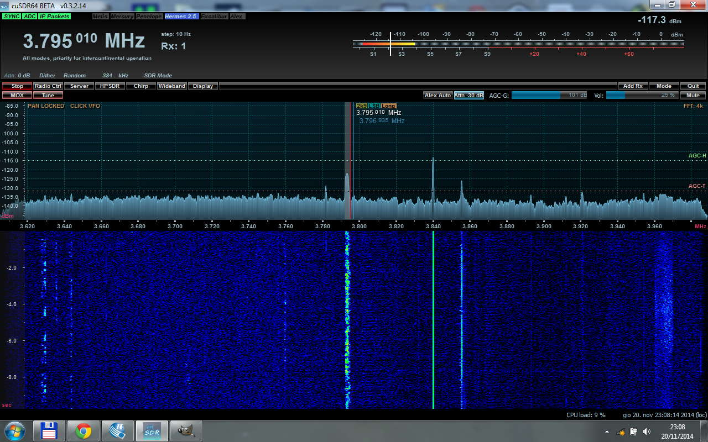
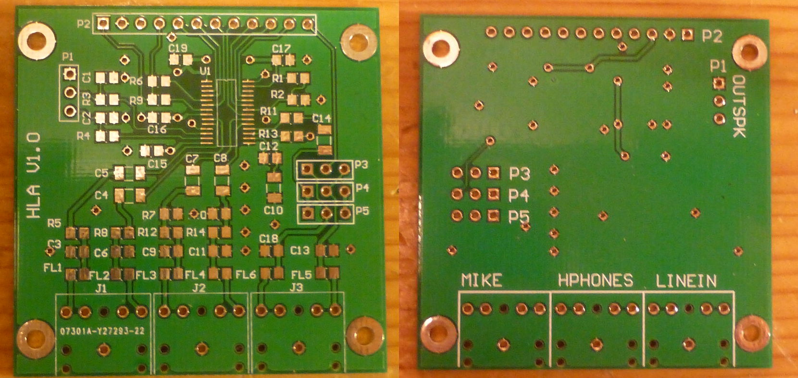
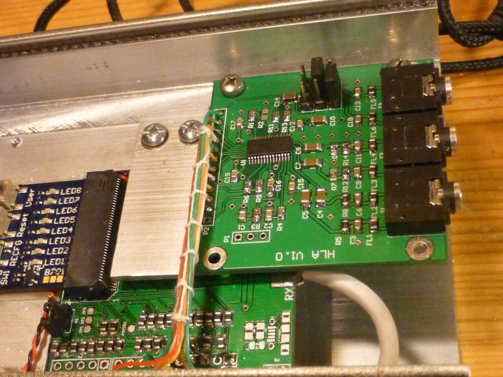
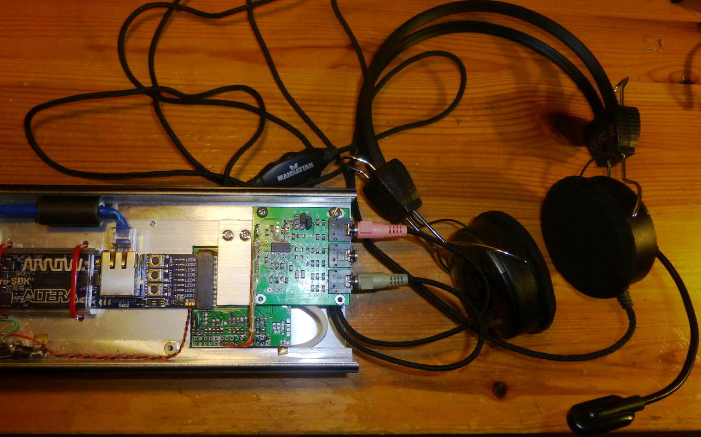

Hermes-Lite (Fork)
===========

Work in progress by Oscar Steila IK1XPV

A Fork from
 [Hermes-Lite](https://github.com/softerhardware/Hermes-Lite) by Steve Haynal KF7O

[Hermes-Lite description](https://github.com/softerhardware/Hermes-Lite/blob/master/README.md)

## Quick Links

 * [Google Groups](https://groups.google.com/forum/#!forum/hermes-lite) discussion forum.
 * [Hardware](https://github.com/softerhardware/Hermes-Lite/blob/master/pcb/README.md)
  * Hermes-Lite [schematic](https://github.com/softerhardware/Hermes-Lite/blob/master/pcb/hermeslite.pdf), [BOM](https://github.com/softerhardware/Hermes-Lite/blob/master/pcb/bom.xls) and [PCB](https://oshpark.com/shared_projects/WHfDeB2c).
  * Basic RF front end [schematic](https://github.com/softerhardware/Hermes-Lite/blob/master/frontend/basic/frontend.pdf), [BOM](https://github.com/softerhardware/Hermes-Lite/blob/master/frontend/basic/bom.xls) and [PCB](https://oshpark.com/shared_projects/K5UywZWT).
 * [RTL](https://github.com/softerhardware/Hermes-Lite/tree/master/rtl/README.md)

## Introduction

This is the report of some test made on Hermes-Lite.
The PCB is v1.1 designed by Rob Frohne KL7NA [PCB v1.1](https://github.com/frohro/Hermes-Lite) and [wiki](https://github.com/frohro/Hermes-Lite/wiki/Circuit-Boards)

#### Audio Lite
Following the project goals:
 * Maintain enough compatibility with Hermes to use existing Hermes SDR front-end software with no or minor modification
 * Cost of less than $150 (cost includes FPGA board) for hobbyist who build their own,

I investigated the possibility to add a low cost audio interface to the Hermes-Lite  [forum](https://groups.google.com/d/msg/hermes-lite/LL2rtrSgdEY/QCAnPJ5fk-YJ).

The idea was to use or design a small PCB that contains a TLV320AIC23B (like Hermes hardware solution) or another ready audio board interfaces via I2S. 

The advantage of the audio interface embedded into the SDR is that latency may be lower and there are not skewing clock problems.

##### 1st order sigma delta DAC
I tested also the possibility to use a direct [sigma delta output](http://en.wikipedia.org/wiki/Delta-sigma_modulation).

The audio output digital stream is made of samples at 48 kHz. The idea to decrease complexity was to synthesize them directly via the 1 bit DAC running at 73.728 MHz.
The advantages are:
The clocks (48, 73.728) are synchronous.

The Nyquist alias of the 48 kHz sampling are over 24 kHz and are not listened by my (old) ears.

I implemented the DACs in the rtl [code](https://github.com/ik1xpv/Hermes-Lite/blob/master/rtl/Sigmadelta.v) with some some minor change to re-activate the audio path.

A RC filtering (300 ohm/ 4n7/ 10uF) is placed at the ouput.

## Receive Experiments

An earphones 3.5mm plug plus rc filter has been cabled.

Hereafter the rc filtering:

## How it sounds ?

Some .wav recording has been made using a 2nd PC running Audacity.

Here some listening made in city with 10m random wire antenna in Torino, Italy about 21 UTC

Radio China on 60m
[AM_cuSDR64_SAM_HermesLite_DAC.wav](http://www.steila.com/SDR/Hermes_Lite/AM_cuSDR64_SAM_HermesLite_DAC.wav "AM_cuSDR64_SAM_HermesLite_DAC.wav")

Here a 80m QSO audio
[LSB_80m_QSO_HermesLite_ADC.wav](http://www.steila.com/SDR/Hermes_Lite/LSB_80m_QSO_HermesLite_ADC.wav "LSB_80m_QSO_HermesLite_ADC.wav")
and in a screen shot:

 

## Note
The audio seems good enough for use as receiving audio.

Now a microphone ADC solution is required. Nevertheless it is difficult to find a simple solution for the ADC converter. Assuming to sample the microphone signal at 73.728 MHz it will generate a high speed stream data that requires a lot of rtl to be decimated to the 48KHz required one.

Possibly the external CODEC board solution is more effective.

# HLA (Hermes Lite Audio) board v1.0

A separate pcb module housing a TLV320AIC32B codec has been designed. It is a clone of the Hermes design and can be wired to gpios of Hermes Lite pcb ( I used it with the [PCB v1.1](https://github.com/frohro/Hermes-Lite) by Rob Frohne KL7NA, [wiki](https://github.com/frohro/Hermes-Lite/wiki/Circuit-Boards) ).
Depending on different pcb some gpio re-assignment may be required.

The schematic and PCB has been designed using Altium cad. Here you can find the [scheme and pcb layout](https://github.com/ik1xpv/Hermes-Lite/audio/pcb/HLAudioboard_v1.0.pdf), here the pcb [gerber files](https://github.com/ik1xpv/Hermes-Lite/audio/pcb/HLA1_0_gerberfiles.ZIP).

BUG01 v1.0: the HPHONES and LINEIN bottom silkscreen are swapped.

The RTL code with the pinout for PCB1.1 is here. The PHONES output and the Microphone input run fine. LINEIN has not jet been used.

It runs with PowerSDR both in rx (1 or 2) and tx, and with CuSDR64 in rx (1|2) in Win7.

